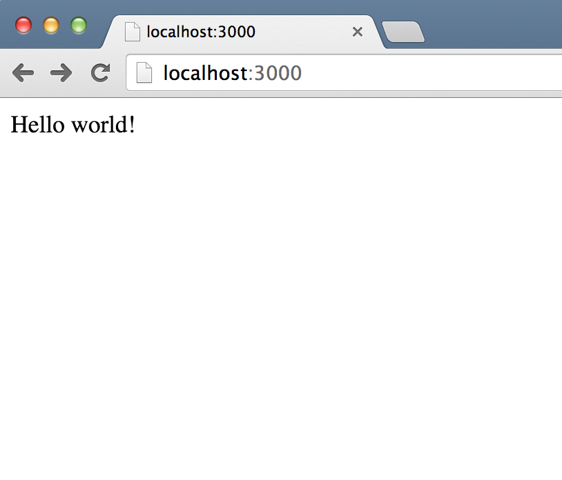

# More Express
## Views and Post Data

| Objectives |
| :---- |
| Send static and templated HTML responses back to the client |
| handle and parse form posts from the client. |
| discuss and review HTTP fundamentals  |


**Directions**: create an `express_examples/` directory somewhere on your machine to follow along.

## Baseline

Let's start with something familiar.

`app.js`

```
var express = require('express'),
  app = express();

app.get('/', function(req, res){
  res.send('Hello world!');
});

app.listen(3000, function () {
   console.log("Up and running!");
});
```

This is something that sends static text back to the client.

Try the above example, copy it, and type the following into your terminal. 

```bash
echo "{}" > package.json
npm install express
pbpaste | node
```

or as an alternative

```bash
mkdir example_1/
cd example_1/
pbpaste > index.js
node index.js
```

Your server should be up and running. You can now curl it to see the response.


```bash
curl -i localhost:3000/
```	

You should see something like the following:


```bash
HTTP/1.1 200 OK
X-Powered-By: Express
Content-Type: text/html; charset=utf-8
Content-Length: 12
ETag: W/"c-1b851995"
Date: Sat, 02 May 2015 22:10:13 GMT
Connection: keep-alive

Hello world!
```

or in the browser you should see the following:




### Views 

Fistly, we cannot keep using `res.send` to send a response. It would be much more efficient to store them in files. Let's make a folder, `/views`, and create an `index.html` page inside.

```
<!doctype html>

<html>
  <head>
  </head>
  <body>
    Hello world!
  </body>
</html>
```

and let's modify the `index.js` to use this file via `res.sendFile`.

`index.js`

```
var express = require('express'),
	path = require('path'),
  	app = express();

app.get('/', function(req, res){
  // use a render
  res.sendFile(path.join(__dirname,'views', 'index.html'));
});
app.listen(3000)
```

The above `strategy` might become tiresome as we keep having to specify our `./views/` folder path to the `res.sendFile` method. Let's create an `options` parameter to use with `res.sendFile`.


`index.js`

```
var express = require('express'),
	path = require('path'),
  	app = express();


// our special little middleware
app.use(function (req, res, next) {
	console.log("running");
	res.sendOps = {
						root: path.join(__dirname, "views")
					};
	res.sendHTML = function (fname, cb) {
		if (path.extname(fname) !== '.html') {
			fname += '.html';
		}
		res.sendFile(fname, res.sendOps, cb || function (err) {
			if (err) {
				res.status(err.status).end();
			} else {
				console.log("Sent:", fname)
			}
		});
	};
	next();
})

app.get('/', function(req, res){
  res.sendHTML("index")
});

app.listen(3000)

```

We could also use Express' built in `app.engine` feature to create a rendering engine for particular responses. Let's create one that reads a file and sends it to the client for all HTML.

`index.js`

```
var express = require('express'),
	path = require('path'),
	fs = require('fs'),
  	app = express();

app.engine('html', function () {
	var args = Array.prototype.slice.call(arguments);
	var path = args.shift()
	var cb = args.pop();
	var file = fs.readFileSync(path).toString();
	cb(null, file);
});

app.get('/', function(req, res){
  // use a render
  res.render("index.html")
});
app.listen(3000)
```

We could use underscores templating functionality to help us render templated html responses.


`index.js`

```
var express = require('express'),
	path = require('path'),
	fs = require('fs'),
	_ = require("underscore"),
  	app = express();
  	

app.engine('html', function () {
	var args = Array.prototype.slice.call(arguments);
	var path = args.shift();
	var data = args.shift();
	var cb = args.pop();
	var file = fs.readFileSync(path).toString();
	var temp = _.template(file);
	cb(null, temp(data));
});

app.get('/', function(req, res){
  // use a render
  res.render("index.html", {greeting: "Hello"})
});
app.listen(3000)
```

### BodyParser

The next thing we need to get ready for is parsing params from a form, which you need an external module for called `body-parser`.

`app.js`

```
var express = require('express'),
  bodyParser = require('body-parser'),
  app = express();

// assuming some middleware to render html responses

var examples = [];

// tell your app to use the module
app.use(bodyParser.urlencoded({extended: true}));

app.get('/', function(req, res){
  // use a render
  res.render('index.html');
});

app.post("/examples", function (req, res) {
  examples.push(res.body.example)
  res.redirect("/examples");
});


app.get("/examples", function (req, res) {
  res.send(examples);
});

```

where `index.html` has a form like the following:

```

<form method="GET" action="/examples">
	<input type="text" name="example[title]">
	<input type="text" name="example[description]">
	<button>Save</button>
</form>
```


### More Templating

We might need to render some data into our views, so we'll also need a module for this, `ejs`. To do this change `index.html` to `index.ejs`.


`app.js`

```
var express = require('express'),
  bodyParser = require('body-parser'),
  ejs = require('ejs'),
  app = express();

// tell your app to use the module
app.use(bodyParser.urlencoded())

app.set('view engine', 'ejs');

app.get('/', function(req, res){
  // use a render
  res.render('index.ejs', {name: "Ruby Rud"});
});

```

then we need to update our `index.ejs` to use a templating variable.

`index.ejs`

```
<!doctype html>

<html>
  <head>
  </head>
  <body>
    Hello, <%= name %>!
  </body>
</html>
```